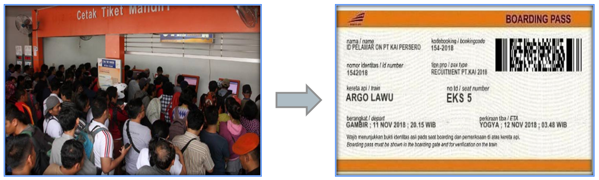
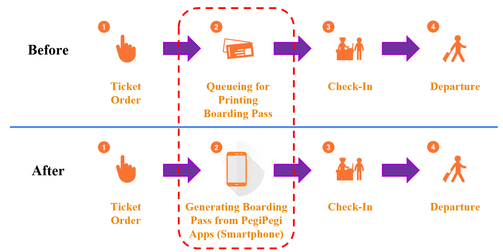
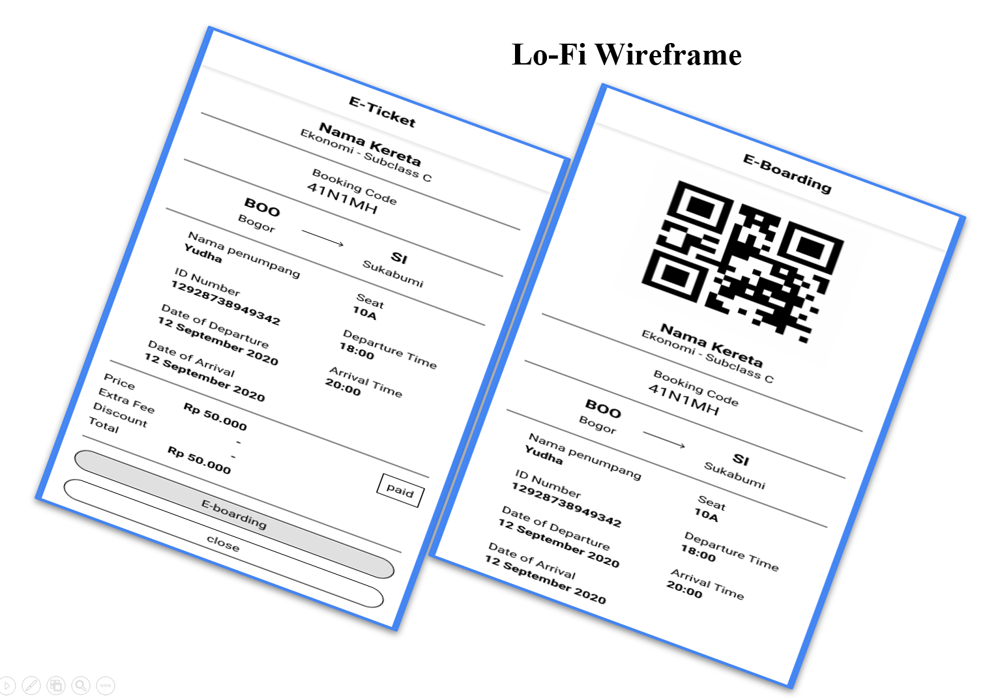
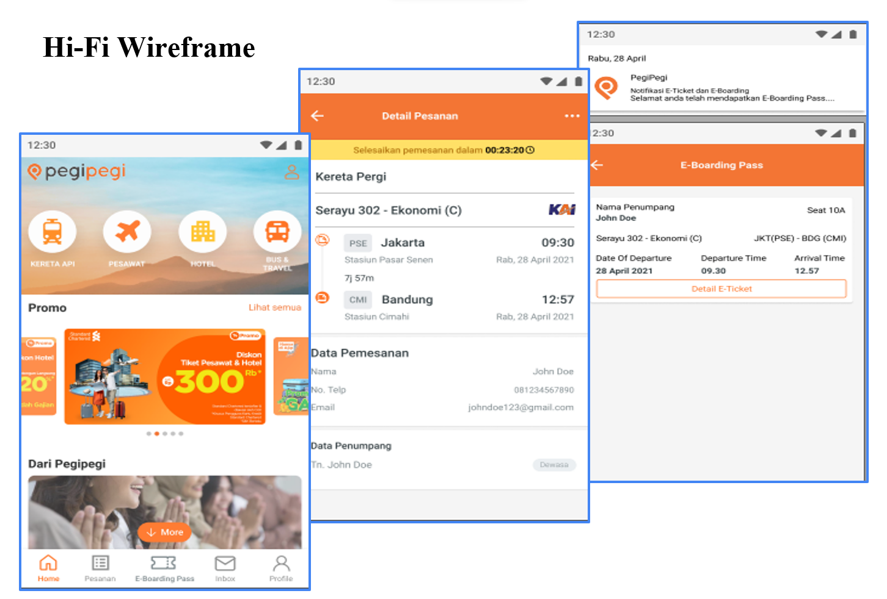
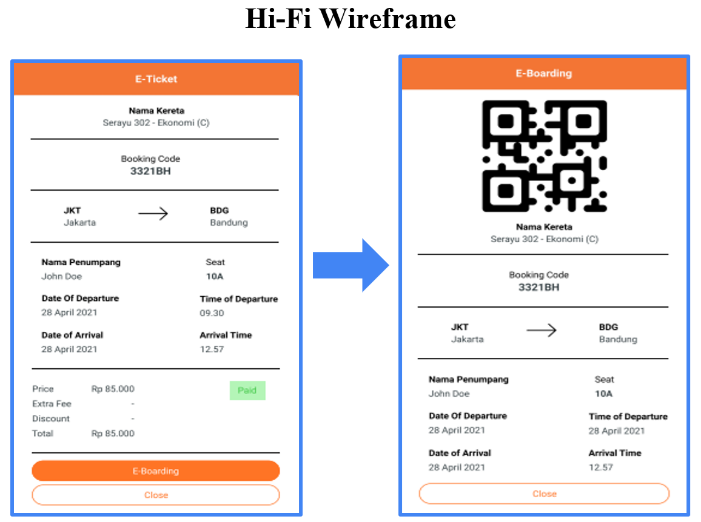

# Product Management Portfolios

Portfolio of my project for bootcamp assignment in [Binar Academy](https://www.binaracademy.com) Product Management Bootcamp and for personal purposes.

Period: January 2021 - May 2021

## Role

1. Understanding the Product Management and Software Development Lifecycle, Organizational Structure, and Stakeholders.
2. Working on Customer Journey Map and Post-Workshop Action Plan that comprises categorizing and prioritizing problems, as well as conducting Quantitative/Qualitative research and competitor analysis for Binar Academy B2B Product.
3. Building product roadmap with clearly defined MVP and timeline, assessing resources and solution with priority framework.
4. Building PRD for Binar Academy B2B product and feature development of an OTA application with clear OKR, determining product’s metrics, and acceptance criteria, as well as other details such as features, user flow, epics and user stories.

## Typical Deliveries

## MVP (Minimum Viable Product)

Proposing an E-Boarding Pass or Electronic Boarding Pass in Pegi-Pegi App that enables passengers to self board. It is aimed to:
- Being Eco-Friendly (reducing paper, electricity and equipment use)
- Improving satisfaction (comes in handy, no long queue, time saving, as easy as one click operation to get boarding pass)

## Problem Background

Long, Crowded, and Time Consuming Queue – Passengers who want to enter platform for boarding onto train in station must printout boarding-pass paper even though they have already had e-ticket.

## User Flow

## Wireframe

a. Lo-Fi Wireframe

b. Hi-Fi Wireframe

## PRD

Details of the MVP will be described in the PRD (Product Requirements Document) that can be found [here](https://drive.google.com/file/d/1m92zTdzL3Lhq7XzivPpCTWyb3BhDOwOZ/view?usp=sharing)
